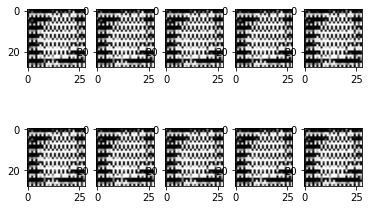

# ConvoltionalGAN
 
## Discriminator
 

## Generator
 

## Generated Image before Learning

## Generated Images after Learning

## Comments
It seems to be that this generative model was failed to learn successfully.
It is possible to be something wrong with the system of this moedel or hyper parameter.
Please leave some advices if you have some ideas.
うまく生成することができませんでした。
何かアドバイス等ありましたらお願いします。
